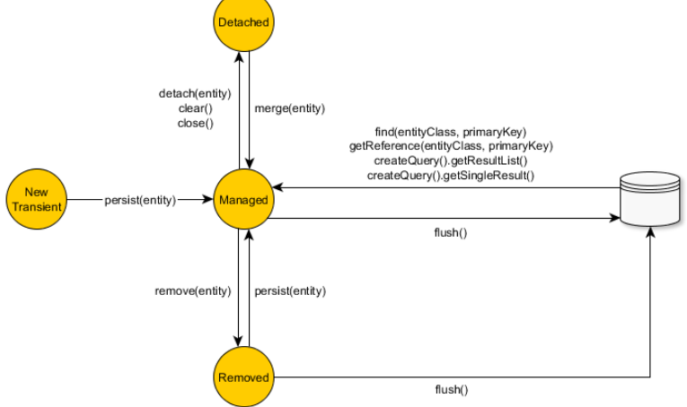
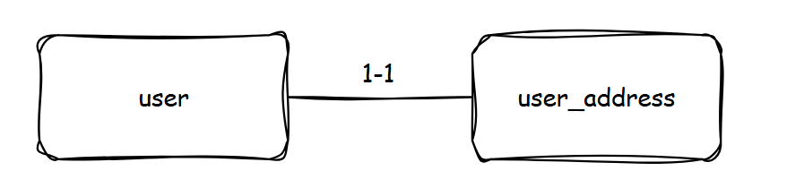
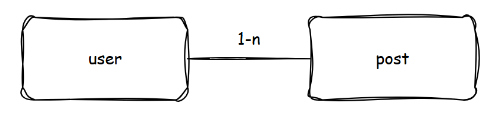

# Spring Data

## Table of contents

---
**Entity Things:**
* [Entity State](#entity-state)
* [Entity Relationship](#entity-relationship)

**Entity Interaction:**
* [Transactional Handler]()
  * [Declarative]()
  * [Programmatic]()
* [Cache]()
* [Locking]()
  * [Pessimistic Locking]()
  * [Optimistic Locking]()

**Attention to reduce issue:**
* [Thumbs of rules](#thumbs-of-rules)
* [Note](#note)
* [Checklist](#checklist)
---

## Entity State

Now, when interacting with data is easier, therefore we face many issues regarding entity state. However, we need to
be aware of them, in case there are issues.



### New
A newly created object that hasn’t ever been associated with a Hibernate Session.
```java
var user = new User();
```

### Persistent (Managed)
A persistent entity has been associated with a database table row, and 
it’s being managed by the current running Persistence Context. 
Any change made to such entity is going to be detected and propagated to the database.
```java
var user = new User(1L, "admin");
entityManager.persist(user);

var firstUser = entityManager.find(User.class, 1L);
```

### Detached
Once the current running Persistence Context is closed all the previously managed entities become detached.

### Removed
Although JPA demands that managed entities only are allowed to be removed, Hibernate can also delete detached entities
(but only through a Session#delete method call).


**_Reference:_**
- https://vladmihalcea.com/a-beginners-guide-to-jpa-hibernate-entity-state-transitions/

---

## Entity Relationship
### 1-1: One To One

#### Fetch Type
- Fetch Lazy for both side.
- Apply **Share Key** for one-to-one relationship. See `@PrimaryKeyJoinColumn`, `@MapsId`.
- When using **Share Key**, remember to set `optional = false` otherwise, 
fetch lazy will not work then we will get N+1 problem.

After above setting up: when you try to get parent, child will not come together. If you want to get all of them let consider
using `@EntityGrapths` with **JPA Query Method** to fetch the child with parent.

**_Code_**
```java
@Entity
@Table(name = "app_user")
public class User {

    @Id
    @GeneratedValue(strategy = GenerationType.IDENTITY)
    private Long id;

    @OneToOne(mappedBy = "user", fetch = FetchType.LAZY, cascade = CascadeType.ALL, optional = false)
    @PrimaryKeyJoinColumn
    private Address address;
}

@Entity
@Table(name = "app_user_address")
public class Address {

    @Id
    @Column(name = "user_id")
    private Long id;

    private String value;

    @OneToOne(fetch = FetchType.LAZY)
    @MapsId
    @JoinColumn(name = "user_id")
    @JsonBackReference
    private User user;
}
```
- [The best way to use the JPA OneToOne optional attribute](https://vladmihalcea.com/best-way-onetoone-optional/)
#### Cascade Type: TODO

### 1-N | N-1:

**_Code_**
```java
@Entity
@Table(name = "app_user")
public class User {

    @Id
    @GeneratedValue(strategy = GenerationType.IDENTITY)
    private Long id;

    @OneToOne(mappedBy = "user", fetch = FetchType.LAZY, cascade = CascadeType.ALL, optional = false)
    @PrimaryKeyJoinColumn
    private Address address;

    @OneToMany(mappedBy = "user")
    @JsonManagedReference
    private Set<Post> posts;
}

@Entity
@Table(name = "app_post")
public class Post {

    @Id
    @GeneratedValue(strategy = GenerationType.IDENTITY)
    private Long id;

    private String content;

    @ManyToOne(fetch = FetchType.LAZY)
    @JsonBackReference
    private User user;

}
```

---
## Note:

### What is N+1 problem?
> The N+1 problem arises in Hibernate due to the way lazy loading is implemented for associations between entities. When lazy loading is used, related entities are fetched from the database only when they are accessed for the first time.

Working with database, we work with tables, and tables have their references.

So **N+1** is something like, when you query for 10 records int **Table A** calls **listA**,
when you access each item in **listA** system will call N query (N as number of A references) 
to find the references of **Table A**.

### Why lazy fetch must be in transactional context?
When we set LAZY Fetch for any entity, associated entities will not come along with parent. Therefore,
they need transaction context in case, you require associated entities.

Below we have a method run without transaction context, then it will potentially throw `LazyInitializationException` when we try to get
associated entities.
```java
/**
 * Three EntityManagers will be created at #1, #3, #4
 */
public UserDTO updateInNonTransactionContext(Long id) {
  var user = userRepository.findById(id).orElseThrow(); // #1
  user.setId(id);
  user.setFirstName(UUID.randomUUID().toString());
  user.setLastName(UUID.randomUUID().toString());
  var address = user.getAddress();
  address.setValue(UUID.randomUUID().toString());
  
  // #2 this will throw Lazy Exception if #1 don't include any
  AddressDTO addressDTO = new AddressDTO(address.getId(), address.getValue());
  
  // #3 get user
  user = userRepository.findById(id).orElseThrow();
  user.setFirstName(UUID.randomUUID().toString());
  user.setLastName(UUID.randomUUID().toString());

  // #4 save user
  userRepository.save(user);
  return new UserDTO(id, user.getFirstName(), user.getLastName(), null, null, addressDTO);
}
```

### Why eager sometimes face **N+1** problem?
We imagine that, using **EAGER LOADING** fetch referenced data, and get them 1 one query. 
But the truth is they still execute many query to get referenced data.

Let's say we have **1 record** in table `table_a` and **4 referenced records** in `referenced_table_a`, 
then the eager loading will trigger as following:
```
1. select * from table_a;

2. For each records from #1
select * from referenced_table_a where id = ?
select * from referenced_table_a where id = ?
select * from referenced_table_a where id = ?
select * from referenced_table_a where id = ?
```

To fix that, you need to use `JOIN FETCH`, then they will get them 1 one query.

### Recommended
- Consider Lazy for all, using `@EntityGraphs`, `FETCH JOIN`, or `JPA Query Method` to get associated entities.

---
## Checklist
### Smell
- [ ] In your local development, let's turn the log on to verify your work with database.
- [ ] Count your queries carefully, any redundant queries?
- [ ] Count number of opening Entity Manager?

### Scan
- [ ] Check default **Fetch Type** for each relationship annotation, do they make sense as your need?
- [ ] If **Lazy Fetch**, use entity in transactional context.
- [ ] If **Lazy Fetch**, then you want to get associated entities, please use `@EntityGraphs`, `FETCH JOIN`.
- [ ] If **Lazy Fetch**, use entity in transactional context.
- [ ] If **Eager Fetch**, use `FETCH JOIN` when getting data.

---

## Thumbs of rules:
- 🔒 **See** [POLA](https://en.wikipedia.org/wiki/Principle_of_least_astonishment):

  Which meant for each entity
  by default it can get its data only (all fetch type should be **LAZY**), in case we want to fetch associated entities,
  let's do that in your **repository** or **service**.
- 👀 **Smell the issue:**

  Attention to SQL generated by the framework.
  To smell them, **your local development must enable** the log to see what's going on.
    ```
    spring.jpa.show-sql=true
    spring.jpa.properties.hibernate.format_sql=true
    spring.jpa.open-in-view=false
    
    logging.level.org.springframework.orm.jpa=DEBUG
    logging.level.org.springframework.transaction=DEBUG
    ```
---