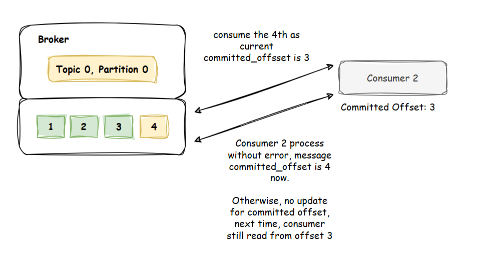

# Kafka


## Dictionary

### Kafka Broker
Heart of kafka, responsible for:
- Receive events from **Producer**, forward them to right place.
- Send events to right **Consumers**.

#### Topic
Like a table in table database, where to store message.

#### Partition, and Offset
**Topics** are split in partitions, each partition is isolated to each other.

**Offset** is index of message in each partition.

So how is a message allocated to a partition?
- If message key is null, message will be allocated **round-robin**.

- If message key is non-null, message will be allocated by hashing strategy. (same key will go to same partition)
```java
int partition = Math.abs(Utils.murmur2(keyBytes)) % (numPartitions - 1);
```

- Producer can decide which partition message will be stored.

### Producer
The one publish message to broker, and producer know in advance which producer to write to (and which broker has it).

#### Producer Acknowledgement
- **acks=0:** Producer won't wait for acknowledge (possible data lost)
- **acks=1:** Producer wait for leader acknowledge (limited data lost)
- **acks=all:** Producer wait for leader, replicas acknowledge (no data lost)

### Consumer
The one consume message from broker, and consumer know in advance which broker, partition they will consume.

#### Delivery Semantics
- **At least once (<= 1):** 
  - Offsets are committed after the message is processed.
  - Meant that messsage can be processed multiple time. Ensure your processing is **idempotent**.
  
- **At most once (>= 1):**
  - Offsets are committed after consumer receive message.
  - Potentially lost message in case processing fail, the message will no longer re-process.
  

---

## Notes
### HeartBeats
To detect whether the consumer is alive or not. We need something called `HeartBeats`, to do that.

**_In consumer view_**, theoretically, consumer need to periodically send a sign to broker and say "I'm fine.", and
we have a property named `heartbeat.interval.ms`, to configure consumer do heartbeats 
every `heartbeat.interval.ms`.

**_In broker view_**, broker will wait for `heartbeats`, and after a period time configured `session.timeout.ms`, if a consumer
don't sent any sign, it will consider as inactive.

### Re-Balancing
#### When
>Kafka re-balancing is the process by which Kafka redistributes partitions across consumers to ensure that each consumer is processing an approximately equal number of partitions. This ensures that data processing is distributed evenly across consumers and that each consumer is processing data as efficiently as possible. As a result, Kafka can scale efficiently and effectively, preventing any single consumer from becoming overloaded or underused.

This term happen when we use `consumer group`. Re-Balancing will perform when:
- Broker detect that there are consumer inactive (lack of heartbeats).
- There are consumers join group.
- There are consumers left group (processing timeout, cannot produce heartbeats, etc.).
- Admin add more partitions to topic.

In short, it will happen when your `consumer group`, `partition` have changed.


#### How

### Properties `max.poll.interval.ms` vs `max.poll.records`

