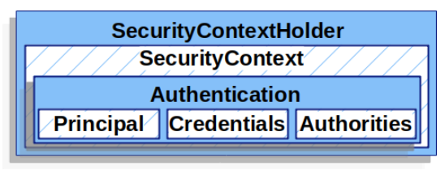
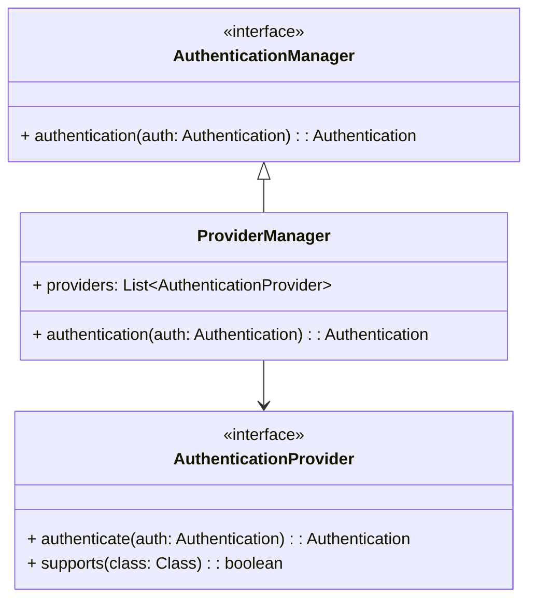

# Spring Security

## Introduction
- Explore basic components that we need to be aware when working with **Spring Security**.
- Explore components used for custom **Spring Security** for your application.
- Visualize how your request go through **Spring Security** components.
- Best practices for securing your Spring applications.

## Basic Components, how we go from traditional way to Spring!

### Filter
In Spring Security, the **Filter** is similar to the concept used in traditional Java web applications 
(e.g., JSP Servlet). Filters act as a layer to process requests before they reach the controller, performing tasks such as:
- Security checks.
- Request header validation.
- Input validation.

Example for simple filter to check if request header is included `Authorization` or not, if not return `401`:
```java
public class AuthRequestFilter implements Filter {
    @Override
    public void doFilter(
            ServletRequest request, 
            ServletResponse response, 
            FilterChain chain
    ) throws IOException, ServletException {
        if (request instanceof HttpServletRequest && response instanceof HttpServletResponse) {
            HttpServletRequest httpRequest = (HttpServletRequest) request;
            HttpServletResponse httpResponse = (HttpServletResponse) response;
            String authHeader = httpRequest.getHeader("Authorization");
            if (authHeader == null || authHeader.isEmpty()) {
                httpResponse.setStatus(HttpServletResponse.SC_UNAUTHORIZED); // 401 status code
                httpResponse.getWriter().write("Unauthorized: Missing Authorization header");
                return;
            }
            
            // here, get and validate JWT as your business
            chain.doFilter(request, response);
        } else {
            chain.doFilter(request, response);
        }
    }
}
```
For simple requirement, implementing a filter as above is enough.

### Filter Chain
Now, what if you want to add more filter, you need to be aware of concept called **Filter Chain**.

The **Filter Chain** is _**a sequence of filters**_ that a request must pass through. 
Each filter in the chain performs a specific security task. 
The chain structure allows Spring Security to apply multiple filters (e.g., authentication, authorization, CSRF protection) 
in a predefined order.

Here is another filter which check if header include `X-Tenant-Id` or not. If yes check current user 
(expected to retrieve from `AuthRequestFilter` after processing JWT Token) with correspond `X-Tenant-Id`
```java
public class TenantFilter implements Filter {

    @Override
    public void doFilter(
            ServletRequest servletRequest, 
            ServletResponse servletResponse, 
            FilterChain filterChain
    ) throws IOException, ServletException {
        HttpServletRequest request = (HttpServletRequest) servletRequest;
        HttpServletResponse response = (HttpServletResponse) servletResponse;

        String tenantId = request.getHeader("X-Tenant-Id"); 
        boolean hasAccess = isUserAllowed(tenantId); 
        if (hasAccess) {
            filterChain.doFilter(request, response); 
            return;
        }
        throw new AccessDeniedException("Access denied"); 
    }

}
```
[Reference: Adding a Custom Filter to the Filter Chain](https://docs.spring.io/spring-security/reference/servlet/architecture.html#adding-custom-filter)

So, we have 2 filters `AuthRequestFilter`, and `TenantFilter`.

How do make sure it run in correct order? 

In traditional ways
1. Configure it on `web.xml`:
```text
<filter>
    <filter-name>authRequestFilter</filter-name>
    <filter-class>com.filter.AuthRequestFilter</filter-class>
</filter>

<filter>
    <filter-name>tenantFilter</filter-name>
    <filter-class>com.filter.TenantFilter</filter-class>
</filter>

<filter-mapping>
    <filter-name>authRequestFilter</filter-name>
    <url-pattern>/*</url-pattern>
</filter-mapping>

<filter-mapping>
    <filter-name>tenantFilter</filter-name>
    <url-pattern>/*</url-pattern>
</filter-mapping>
```
2. Programmatically configuration:
```java
@WebListener
public class MyServletContextListener implements ServletContextListener {

    @Override
    public void contextInitialized(ServletContextEvent sce) {
        ServletContext context = sce.getServletContext();

        // Register AuthRequestFilter first
        Dynamic authFilter = context.addFilter("authRequestFilter", new AuthRequestFilter());
        authFilter.addMappingForUrlPatterns(null, false, "/*");

        // Register TenantFilter second
        Dynamic tenantFilter = context.addFilter("tenantFilter", new TenantFilter());
        tenantFilter.addMappingForUrlPatterns(null, false, "/*");
    }
}
```

The more filters you need, the more configurations and management are required. 
Then Spring Security comes in, providing additional functionalities and support to streamline this process.

### DelegatingFilterProxy
**_So what if we integrate these filters with Spring Framework as Spring Bean_** or 
**_how can servlet filter be aware of Spring Bean?_** Then we have **DelegatingFilterProxy**.

> Spring provides a Filter implementation named DelegatingFilterProxy that allows bridging between the Servlet container’s lifecycle and Spring’s ApplicationContext. The Servlet container allows registering Filter instances by using its own standards, but it is not aware of Spring-defined Beans. You can register DelegatingFilterProxy through the standard Servlet container mechanisms but delegate all the work to a Spring Bean that implements Filter.

We can use `DelegatingFilterProxy` like this:
```java
@Bean
public FilterRegistrationBean<DelegatingFilterProxy> authFilterRegistration() {
    FilterRegistrationBean<DelegatingFilterProxy> registrationBean = new FilterRegistrationBean<>();
    registrationBean.setFilter(new DelegatingFilterProxy("authRequestFilter"));
    registrationBean.addUrlPatterns("/*");
    registrationBean.setOrder(0);
    return registrationBean;
}

@Bean
public FilterRegistrationBean<DelegatingFilterProxy> tenantFilterRegistration() {
    FilterRegistrationBean<DelegatingFilterProxy> registrationBean = new FilterRegistrationBean<>();
    registrationBean.setFilter(new DelegatingFilterProxy("tenantFilter"));
    registrationBean.addUrlPatterns("/*");
    registrationBean.setOrder(1);
    return registrationBean;
}
```
In fact, **_the lower numbers order represent, the higher priority._**

### FilterChainProxy and SecurityFilterChain
From what we have with `DelegatingFilterProxy`, we know how to make servlet filter aware
of Spring Bean. 

However, **_do Spring provide other ways to manage filter bean better?_** Yes, we have **FilterChainProxy**, **SecurityFilterChain**.

In case, we have a bunch of filters, let's think about **FilterChainProxy** is a special 
**Filter** provided by Spring Security that allows delegating to many 
**Filter** instances through SecurityFilterChain.
Since **FilterChainProxy** is a Bean, it is typically wrapped in a **DelegatingFilterProxy**.

Let's see below:
```java
public FilterChainProxy(SecurityFilterChain chain) {
    this(Arrays.asList(chain));
}

public FilterChainProxy(List<SecurityFilterChain> filterChains) {
    this.securityContextHolderStrategy = SecurityContextHolder.getContextHolderStrategy();
    this.filterChainValidator = new NullFilterChainValidator();
    this.firewall = new StrictHttpFirewall();
    this.requestRejectedHandler = new HttpStatusRequestRejectedHandler();
    this.throwableAnalyzer = new ThrowableAnalyzer();
    this.filterChainDecorator = new VirtualFilterChainDecorator();
    this.filterChains = filterChains;
}
```

**_But what invoke above constructors?_** Actually, it's invoked when you create bean of **SecurityFilterChain** like:
```java
@Bean
SecurityFilterChain securityFilterChain(HttpSecurity http) throws Exception {
    return http
            .authorizeHttpRequests(
                    authorizeHttp -> {
                        authorizeHttp.requestMatchers("/public/**").permitAll();
                        authorizeHttp.anyRequest().authenticated();
                    }
            )
            .httpBasic(withDefaults())
            .build();
}
```
Now, what we need to do is providing your security stuff to **SecurityFilterChain**. It will arrange your stuffs.
- [Reference: Filter Chain](https://docs.spring.io/spring-security/site/docs/3.0.x/reference/security-filter-chain.html)

### Handling Security Exceptions // TODO

## Spring Security Time
### Security Filter
#### Filter

### Authentication Components
#### 1. SecurityContextHolder:
When a request pass **Spring Security**, how can we know current user is authenticated or not? 
We can get the `SecurityContextHolder` as it contains the details of who is authenticated.



The fastest way to get current user in **Spring Application** is:
```Java
Authentication authentication = SecurityContextHolder.getContext().getAuthentication();
```
It's expected to be saved once you complete the authentication (checking credentials, etc.), 
and cleared after your request ends. But you don't need to care about how does it clear, 
**Spring Security** will manage that, 
you only need to handle setting `SecurityContextHolder` in some cases.

By default, it uses `ThreadLocal` to store `SecurityContextHolder`.

#### 2. Authentication
According to Spring Security:
>The Authentication interface serves two main purposes within Spring Security:
>- An input to AuthenticationManager to provide the credentials a user has provided to authenticate. When used in this scenario, isAuthenticated() returns false.
>- Represent the currently authenticated user. You can obtain the current Authentication from the SecurityContext.

> The Authentication contains:
>- principal: Identifies the user. When authenticating with a username/password this is often an instance of UserDetails.
>- credentials: Often a password. In many cases, this is cleared after the user is authenticated, to ensure that it is not leaked.
>- authorities: The GrantedAuthority instances are high-level permissions the user is granted. Two examples are roles and scopes.


In short, what is:
- Input for authentication.
- Authenticated user.

#### 3. GrantedAuthority
When you have **Authentication**, you also have something called **Authentication**. 
Then this one represent for user roles and will be used on 
web authorization, method authorization, etc.

#### 4. Authentication Manager, Provider Manager
An interface, a skeleton for authentication work:
```java
public interface AuthenticationManager {
    Authentication authenticate(Authentication authentication) throws AuthenticationException;
}
```
Then there is thing called **ProviderManager** implement **AuthenticationManager**, 
that will delegate all **AuthenticationProvider**.


- **AuthenticationManager**: authentication skeleton `authentication(Authentication authentication)`.
- **ProviderManager:** check and execute authentication implementation, called `AuthenticationProviders`.
- **AuthenticationProvider**: where perform your authentication logic.

**Question:** If you have many providers, when doing authentication, do we execute all of them?

No, when you create your own authentication provider, you need to define 2 things:
1. `authenticate(auth)`: authentication logic.
2. `supports(class)`: authentication type your provider support.

That meant, _**all providers having same authentication input type will be executed together.**_
### Authorization Components
